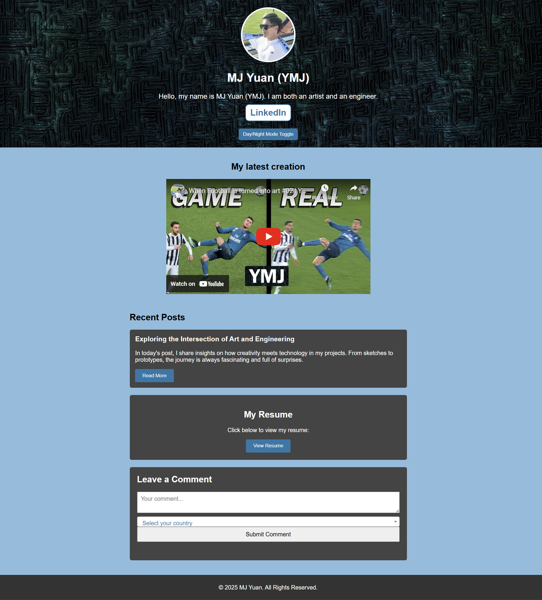

# My-Blog
The free server takes one minute to start responding:
https://my-blog-v2p4.onrender.com/

>>>>>>> d582d84 (Updated VS Code assets)
### MJ Yuan's Blog Website

A full-stack blog website that demonstrates modern web development techniques—from a dynamic, responsive front-end to a simple Express-based back-end API.

### 🖼 Project Screenshot  


## Overview
This project is a personal blog site that showcases:

1. A responsive user interface built with HTML, CSS, JavaScript, and jQuery.
2. Interactive features such as a theme toggle (Day/Night Mode) and a searchable country dropdown (powered by Select2).
3. A Node.js/Express backend that provides RESTful API endpoints for submitting and retrieving comments.
4. Automated testing of API endpoints using Jest and Supertest.
5. A complete file structure with static assets served from the public folder.

## Features
1. Full-Stack Development: Front-end and back-end integrated seamlessly.
2. Responsive Design: Mobile-friendly UI with dynamic styling and a background image header.
3. Theme Toggle: Users can switch between light and dark modes.
4. Dynamic Data Loading: AJAX loads a complete list of countries into a Select2 dropdown.
5. Comment Section: Users can submit comments, which are stored in-memory via the Express API.
6. Automated Testing: API endpoints are covered by tests using Jest and Supertest.

## File Structure
```bash
MyBlog/                   # Root folder of your project
├── public/               # Folder for static files served by Express
│   ├── index.html        # Main landing page of the blog
│   ├── resume.html       # Page that displays your resume (PDF embedded)
│   ├── secret.html       # Page showing a secret message
│   ├── style.css         # Main stylesheet with responsive and theme styles
│   ├── script.js         # JavaScript for interactivity (e.g., dynamic country dropdown, theme toggle)
│   ├── background1.jpg   # Custom background image used in the header
│   ├── countries.json    # JSON file containing the complete list of countries
│   └── MyResume.pdf      # PDF file of your resume
├── server.js             # Express server file that serves static files and provides API endpoints
├── package.json          # Project metadata, dependencies, and scripts
├── package-lock.json     # Automatically generated file locking dependency versions
├── README.md             # This file: a project summary, instructions, and overview
└── tests/                # Folder for automated tests
    └── api.test.js       # Tests for API endpoints using Jest and Supertest
```

## Installation & Setup
1. Clone the Repository: 
git clone <repository_url>
cd MyBlog

2. Install Dependencies:
npm install

3. Run the Server:
node server.js

4. Open the Application:
Navigate to http://localhost:3000 in your browser to view the website.

## Testing
1. Automated API Tests:
npm test
(All API endpoints should pass the tests as defined in tests/api.test.js.)


## Deployment
You can deploy this full-stack application using free hosting platforms such as Render, Vercel, or Heroku (if available). For example, with Render:
1. Connect your Git repository.
2. Specify the start command as node server.js.
3. Render will deploy your project, serving both static files and your Express API endpoints.

## Technologies
1. Front-End: HTML, CSS, JavaScript, jQuery, Select2
2. Back-End: Node.js, Express
3. Testing: Jest, Supertest
4. Version Control: Git

## Conclusion
This project showcases my experience in full-stack web development: swanky, dynamic front-end interactivity, robust API design, automated testing, and modern deployment practices. Feel free to have a look at the code and ask me any questions or leave any feedback.
